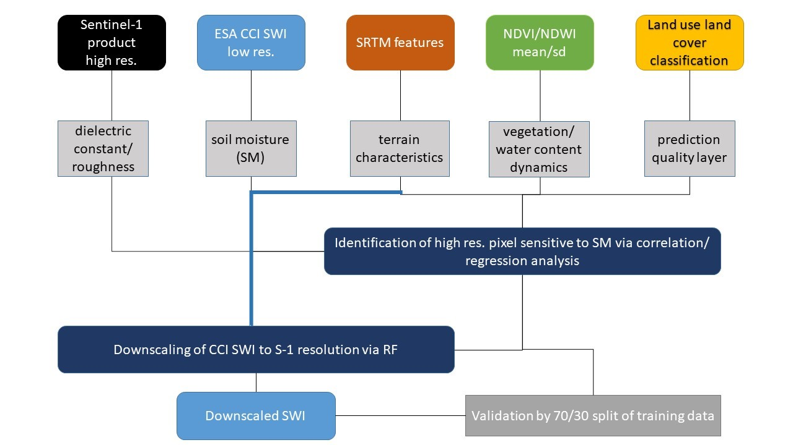

# SSM_downscale
A repository for downscaling ESA CCI Soil moisture products using Sentinel or Landsat Products

# Remote sensing for monitoring and managing water resources in data-scarce regions
As described by Lorenz & Kunstmann (2012), there is a trend towards reducing the infrastructure for agricultural and hydro-meteorological monitoring networks, especially in developing regions. In addition, Fay et al. (2017) reported that this trend has not been reversed and investments in infrastructure and training remain on a suboptimal level. In regions of sparse data quantity and quality earth observation data is often been referred to as the only feasible source of information. (Sheffield et al. 2018). Recent developments in the field of remote sensing allow for direct and indirect measurements of many elements of the hydrological circle (Lettenmaier et al., 2015; McCabe et al., 2017; Zhang et al., 2016). Nowadays, earth observation provides a wide range of products supporting the monitoring and management of water resources. This includes for example information on precipitation, water levels, evaporation, soil moisture and snow. In addition, remote sensing has a proven record of successfully retrieving information about phenology and plant health. Hence, earth observation data is a valuable asset for risk and hazard assessment especially because there are many sensor constellations and products, which provide information in near real time on a near global scale (Sheffield et al. 2018). 
In context of MedWater the focus was set on generating information about near-surface soil moisture.  The University of Würzburg was tasked with creating high-resolution soil moisture maps. Due to the lack of in situ data, which covered the entire focus region of the Western mountain aquifer, a machine-learning based approach was developed to downscale global soil moisture products. Based on the assumption and in accordance with the literature (Peng et al. 2017), that soil moisture can be derived by remote sensing employing the following term: 
```
SSM = SAR + terrain + vegetation + vegetation water content
```

These variables are related to the following databases:
* SAR= Sentinel-1 backscatter intensity imagery; covering surface roughness and dielectric constants
* terrain= SRTM features: slope, aspect convergence, topographical wetness index (TWI); covering the morphology of the land surface
* vegetation= mean and standard deviation of NDVI time series: covering vegetation dynamics 
* vegetation water content= mean and standard deviation of NDWI time series: covering the water content of the vegetation layer: it is assumed that vegetation with a constantly high water content is related to a comparatively high soil moisture. 
Based on this concept the following approach was developed.



# References

* Fay, M., Andres, L. A., Fox, C., Narloch, U., Staub, S., & Slawson, M. (2017). Rethinking infrastructure in Latin America and the Caribbean: Spending better to achieve more. World Bank, Washington, DC. © World Bank. https://openknowledge.worldbank.org/handle/10986/26390
* Lettenmaier, D. P., Alsdorf, D., Dozier, J., Huffman, G. J., Pan, M., & Wood, E. F. (2015). Inroads of remote sensing into hydrologic science duringthe WRR era. Water Resources Research, 51, 7309–7342. https://doi.org/10.1002/2015WR017616
* Lorenz, C., & Kunstmann, H. (2012). The hydrological cycle in three state-of-the-art reanalyses: Intercomparison and performance analysis. Journal of Hydrometeorology, 13, 1397–1420. https://doi.org/10.1175/JHM-D-11-088.1
* McCabe, M. F., Rodell, M., Alsdorf, D. E., Miralles, D. G., Uijlenhoet, R., Wagner, W., et al. (2017). The future of earth observation in hydrology. Hydrology and Earth System Sciences Discussions, 21, 3879–3914.
Peng, J., A. Loew, O. Merlin, and N. E. C. Verhoest (2017), A review of spatial downscaling of satellite remotely sensed soil moisture, Rev.Geophys., 55, 341–366, doi:10.1002/2016RG000543.
* Schmidt, S. Grimmeisen, F., Ries, F. Goldscheider, N., Sauter, M. (2018) High-resolution monitoring of karst groundwater resources on both sides of the Jordan Valley – concepts and application examples. Grundwasser 23, 59-72
* Sheffield, J., Wood, E. F., Pan, M., Beck, H., Coccia, G., Serrat-Capdevila, A., & Verbist, K. (2018). Satellite remote sensing for water resources management: Potential for supporting sustainable development in data-poor regions. Water Resources Research, 54. https://doi.org/10.1029/2017WR022437
* Zhang, Y., Pan, M., & Wood, E. F. (2016). On creating global gridded terrestrial water budget estimates from satellite remote sensing. Surveys in Geophysics, 37(2 SI), 249–268. https://doi.org/10.1007/s10712-015-9354-y
